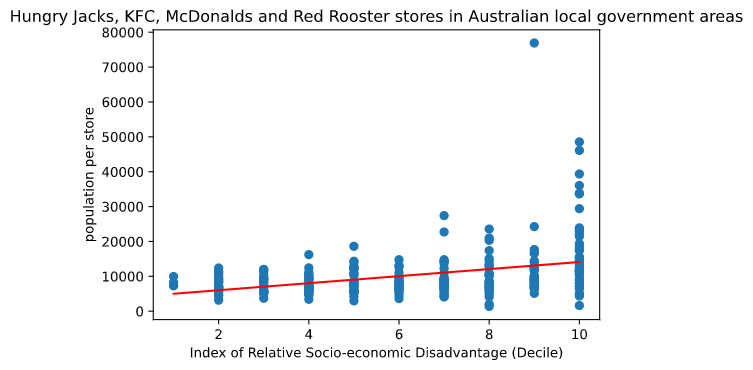

# Fast food and social disadvantage

This is some research I wanted to do regarding fast food and social disadvantage.

### Steps to reproduce:

    # use Python >= 3.6
    pip install -r requirements.txt
    ./collectRestaurantData.sh
    ./combineRestaurantData.py
    # follow manual steps in collectABSData.md
    ./getLgaStoreSummary.py #This part is very slow, would be good to make it faster
    ./checkSums.py
    jupyter notebook #read through notebook to see results

Briefly, here's what this shows us:

This is for 270-odd LGAs, since many LGAs don't have any restaurants of these brands.

### Questions about data
- Is SEIFA an indication that communities are more likely to face poverty?
- Are people currently less or more likely to be buying takeaway food? Are they more likely to buy food close to them?
- Are the data of restaurants exhaustive, or are there stores that are not on the maps?
- Is comparing SIEFA to restaurants per population a good statistic? Is this a significant correlation?
- How do chains decide if stores in different areas will be successful? Is there a threshold to how much surplus money people have?
- With all areas considered, there are many less advantaged areas that have no stores. Where chains do have stores, they are more likely to be in less advantaged areas, per population. Why is this?
- Regarding areas that do not have stores, do those have something in common?

### Notes
- Most popular restaurants by visitor numbers - https://www.roymorgan.com/findings/7599-australian-eating-habits-eating-in-out-march-2018-201805290253
- Domino's, could scrape and geocode this - https://www.dominos.com.au/store-finder
- Grill'd, could scrape and geocode - https://www.grilld.com.au/locations
- Nando's, haven't looked at data availability - https://www.nandos.com.au/restaurants
- Subway has healthier options, but many people choose unhealthy options, so would it reveal anyhthing interesting?

